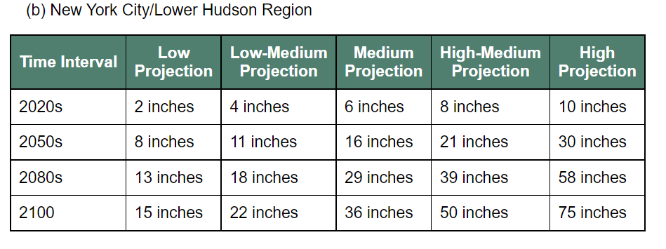
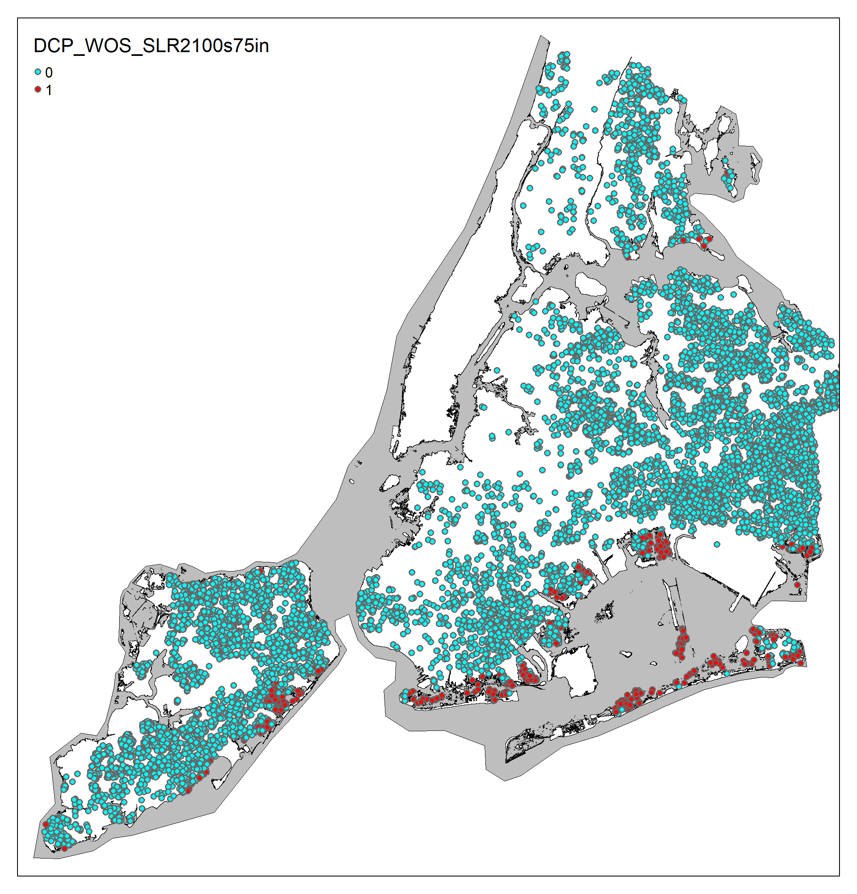

```{r,echo=F}
knitr::opts_chunk$set(message=F,warning=F)
```
# Housing Prices in Tidal Flood Zones 

## Introduction  

The standard approach for evaluating the cost of housing in Urban and Regional Economics is the Hedonic price function. Unlike the bid-rent curve model which takes location and square footage as the only determining factors of housing price, the Hedonic model is able to bundle different amenities to create a utility function for consumers and thus give insight into consumers' willingness to pay for certain features. As illustrated by the countless applications of the hedonic approach, an “amenity” is anything that might increase or decrease the value of a home i.e, school district rating, proximity to parks, access to public transportation, racial diversity, and socioeconomic status of the neighborhood. In creating a hedonic price regression, economists are able to make claims about what goods and amenities are valuable to a consumer.  For my final project I wanted to investigate whether homeowners consider the effects of climate change, specifically future sea level rise, when purchasing a home. 

As has been extensively demonstrated by climate scientists, coastal cities in the United States will be drastically affected by sea level rise. Since 2001 researchers have been raising alarm about the particularly drastic amount of sea level rise (SLR) that New York City will experience. ^[[Vivien Gornitz, Stephen Couch, Ellen K Hartig, Impacts of sea level rise in the New York City metropolitan area, Global and Planetary Change, Vol 32, Is 1, 2001, Pg. 61-88, ISSN 0921-8181, https://doi.org/10.1016/S0921-8181(01)00150-3](https://www.sciencedirect.com/science/article/pii/S0921818101001503?casa_token=o1xW0HGTrCwAAAAA:vNNYCv3erH2MclfVq__Q8lcG-XF2OWB_N3dpaNHH76ofEp2NfMvpiPyejiuBVMJaRIujSNF9mDMV)] In 2015, the New York City Panel on Climate Change released [a report](https://nyaspubs.onlinelibrary.wiley.com/doi/full/10.1111/nyas.12593)^[Horton, R., Little, C., Gornitz, V., Bader, D. and Oppenheimer, M. (2015), New York City Panel on Climate Change 2015 Report Chapter 2: Sea Level Rise and Coastal Storms. Ann. N.Y. Acad. Sci., 1336: 36-44. https://doi.org/10.1111/nyas.12593] on sea level rise and coastal storms that is widely used and cited by climate researchers and practitioners in New York City. Despite the very real threat that climate change poses to New York City’s coast, it is unclear whether or not New Yorkers are cognizant of how sea level rise will change their lives and affect their homes. To analyze whether or not proximity to floods affects a consumer's willingness to pay for housing I conduct spatial analysis and run a regression on the cost of homes in future flood zones.  

## Methods  

```{r,echo=F,message=FALSE}
library(tidyverse)
library(ggplot2)
library(ggthemes)
library(magrittr)
library(readr)
library(tidyr)
library(dplyr)
library(fixest)
#setwd("~/ECON 184 - Econometrics/Final")
```

```{r}
#loading data 
load_flag = FALSE

if(load_flag){
  data = read.csv("https://raw.githubusercontent.com/f1kidd/Econ184/main/Final%20Project/Housing_Transaction.csv")
  census = read.csv("census_bg_demographics.csv")
  save(data, census, file = "Housing_Transaction.Rdata")
} else {
load("~/ECON_184_Econometrics/Final/Housing_Transaction.Rdata")
}
```
To create a hedonic price regression for housing in New York City I used a random sample of 100,000 housing sales preformed in NY state between 1993 and 2020. I cleaned the sample to only include four New York City boroughs, Brooklyn, Bronx, Staten Island and Queens using county FIPS codes. The sample of housing transactions was already limited to the purchase of single family homes so all data from Manhattan was in the multiple millions and orders of magnitude larger than the price of homes in any of the other boroughs. Additionally there were very few observations from Manhattan and only a couple of those homes were in the predicted flood zones. I excluded Manhattan to improve the accuracy of the model. 

At the recommendation of an article detailing best practices in using Hedonic Models to model WTP for environmental amenities, [Bishop et al. 2020](https://www.journals.uchicago.edu/doi/abs/10.1093/reep/reaa001?journalCode=reep)^[Bishop, Kuminoff, N. V., Banzhaf, H. S., Boyle, K. J., von Gravenitz, K., Pope, J. C., Smith, V. K., & Timmins, C. D. (2020). Best Practices for Using Hedonic Property Value Models to Measure Willingness to Pay for Environmental Quality. Review of Environmental Economics and Policy, 14(2), 260–281. https://doi.org/10.1093/reep/reaa001] I further limited my data to not include any homes that were sold as foreclosures, (*distressed_sale*) or any homes sold by banks, (*‘Yes:Lender Selling’*) because of the unreliability of data concerning both of those types of transactions. The above article similarly suggested that time period for housing data should be limited to a few years and mindful of trends in the housing market, such as recessions, booms, and busts.  I used time as a fixed effect in my regression so that the overtime increases in housing costs (see plot 1 and plot 2 below) could be properly accounted for.   
```{r}

#transforming data
boros = filter(data, fips %in% c('36005','36081','36047','36085'), distressed_sale == FALSE, real_estate_owned != "YES:LENDER SELLING")

#Binding data
boros = boros%>% left_join(census,by="census_bg")

```

```{r, echo=FALSE}
# The input file geodatabase
floodgdb <- "C:\\Users\\19085\\OneDrive\\Documents\\ECON_184_Econometrics\\Final\\NYCFutureHighTideWithSLR.gdb"
# output files
data_out <- "boros.RData"
```

## Spatial Analysis using sf and tmap package:
```{r, message=FALSE, results="hide"}
library(sf)
library(tmap)
# Load spatial data and determining projection data, setting coordinate system
gdb_layers <- st_layers(dsn = floodgdb)

# Layer names in tide geodatabase:
gdb_layers$name

j = 1
layer_name = gdb_layers$name[j]

tide_sf <- st_read(dsn = floodgdb, 
                   layer=layer_name)

# SLR data is in NAD83/new york long island projection
tide_crs <- st_crs(tide_sf)

####
# Load csv data and transform to NAD83 projection
###
# convert housing transaction data frame into sf object
boros_sf <-  st_as_sf(boros,
                   agr = "identity",
                   coords = c("longitude", "latitude")
)

#A CRS can be added to sf 
boros_geo = st_set_crs(boros_sf, "EPSG:4326")

# Check for CRS metadata
st_is_longlat(boros_sf)

# Project data onto tide data projection NAD83
boros_proj = st_transform(boros_geo, tide_crs)
# check projection
st_is_longlat(boros_proj)
st_crs(boros_proj)

```
For data about future sea level rise in New York City, I used the NYC open data site [Bytes of the Big Apple](https://www1.nyc.gov/site/planning/data-maps/open-data.page) and found a geodatabase that contained shapefiles for each of the predictions made by the 2015 Panel on Climate Change. The researchers made 5 levels of predictions for four time periods, the 2020’s, 2050’s, 2080’s, and 2100’s summarized in the table below.   

My aim was to find the homes that were located within the various sea level rise prediction areas and see whether their location had an effect on the price of the home. Using the sf and tmap package in R I converted my housing dataset (boros) to the right coordinate system and projection and loaded the SLR geodatabase. The code below takes all the houses in the data.frame (*boros*) and reads it against each of the layers from the geodatabase (Sea Level Rise for each time period for every level or prediction). If a house intersects with any of the thousands of polygons that make up each of the shapefile layers (*any_column_true*) R assigns a 1 to the column pertaining to the layer. The end result is a table with 1s, if the house can be found in the flood zone and a 0 if it is not in the zone. Because of its coverage, the shapefile depicting the highest projection for sea level rise in the 2100s contains the most amount of houses (*n=467*.) 
```{r, message = F, results="hide"}
# # # # #  
# Loop through list of layers, Check intersection of points with each layer
# Add new column to df_proj where 0=FALSE, 1=TRUE intersection with tide map
# New column is named after tide layer
# # # # #  
for (j in 1:length(gdb_layers$name)){

  layer_name = gdb_layers$name[j]
  
  tide_sf <- st_read(dsn = floodgdb, 
                     layer=layer_name)
  
  # Find intersection of each of the polygons with each point in df_proj
  intersect_all = st_intersects(boros_proj, tide_sf, sparse = FALSE)
  
  # If the df_proj data coordinate is in any of the polygons, then intersection is true
  any_column_true = apply(intersect_all, 1, any)
  true_index      = which(any_column_true)
  
  # Get list of column names
  col_names = colnames(boros_proj)
  
  # Add new column of 0's and 1's representing intersection with tide layer
  boros_proj <- boros_proj %>% mutate(new_column_name = 0)
  boros_proj$new_column_name[true_index] = 1
  
  # Convert to factor
  boros_proj$new_column_name <- as.factor(boros_proj$new_column_name)
  
  # Rename the new column to match the tide layer
  col_names_new = c(col_names, layer_name)
  colnames(boros_proj) = col_names_new
  
}

# Save dataframe to RData output file
save(boros_proj, file = data_out)

```
## Results

> The images below show that in the short run very little flooding will occur, however in the long run entire chunks of NYC get swallowed up by the tide. (See Brightion Beach, and Far Rockaway)  

I did some basic exploratory analysis to see if the house prices differed that significantly from each other. I used the most extreme geometry because it encompassed the most amount of homes. The plots and summary table showed some of the flaws with my data and my approach. As expected, the price increases with time significantly and also varied within each year. There are a few outliers which likely makes the regression rather inaccurate. With a much bigger dataset the analysis would have been more accurate. 
```{r, echo = F}
library(fixest)
library(lmtest)
library(sandwich)
library(ggplot2)
```

```{r,}
#exploratory data analysis
boros_proj %>% group_by(DCP_WOS_SLR2100s75in) %>% summarise(mean = mean(sale_price), min(sale_price), max(sale_price), n = n())
```

```{r, echo = FALSE}
##plots
ggplot(boros_proj, aes(x=saleyear, y=sale_price/100000)) + 
  geom_point()+ geom_smooth(method=stats::lm, formula =y~x, color="red", se=TRUE,level = 0.95,)+theme_grey()+labs(x="Year", y="Price in 100,000's", title = "Price of homes sold 1993 to 2020 across all 4 Boroughs", caption = "Plot 1")

#Flood Zone Plots
ggplot(boros_proj %>% filter(boros_proj$DCP_WOS_SLR2100s75in ==1), aes(x=saleyear, y=sale_price/100000)) + geom_point()+geom_smooth(method=stats::lm, formula=y~x, color = "red", se = TRUE, level = 0.95) +theme_grey()+labs(x="Year", y="Price in 100,000's", title = "Price of homes sold 1993 to 2020 in the 2100s 75in tidal flood zone", caption = "Plot 2") 

```
  
The regression below is a timed fixed effect regression taking into account total square footage, the year the house was built, amount of stories, racial diversity, median income and educational attainment level of the census block group. Additionally to measure whether being in the flood zone has an effect on home values I included the spatial dummy variables for Sea Level Rise data for the 2100s. Unfortunately because of limitations in data I was not able to fully account for everything that might be moving sale_price in either direction. This model suffers from omitted variable bias since I was not able to include the quality of school districts, access to green spaces, access to public transportation, a variable controlling for the effect of a beach view property, etc.    

```{r}
#regression analysis    
fixed = feols(log(sale_price)~total_area_sq_ft+year_built+as.numeric(stories)+white+black+asian+hispanic+below_high_school+high_school+some_college_associate+college+median_income+DCP_WOS_SLR2100s15in+DCP_WOS_SLR2100s22in+DCP_WOS_SLR2100s36in+DCP_WOS_SLR2100s50in+DCP_WOS_SLR2100s75in|saleyear+as.factor(fips), data=boros_proj)
summary(fixed, cluster=~saleyear)
```
The results of this regression show that an increase in square footage and the year when a home was built increase the home value. Homes in predominantly white neighborhoods cost more than homes in neighborhoods dominated by any other racial group. Homes in sea level rise zones cost less and some of the coefficients are statistically significant at a 95% confidence level. However many things could be explaining this difference in price.

## Conclusions and Next Steps: 
The noticeable difference in price between homes in and out of the future sea level rise zones can be attributed to the locations of the homes and their location based property value. Many of the homes washed away from the predictions for 75 in SLR in 2100 are located in the part of Brooklyn furthest from downtown (Brighton Beach, Far Rockaway) the coast of Staten Island (the most affordable of the 5 boroughs), and the eastern parts of Queens. The homes in those areas already cost less than much of the dataset. Additionally, despite controlling for racial makeup, education, and income there are plenty of factors that I didn’t account for in this model that might be attributing to the lower cost of homes.

The biggest issue with my research and the model I just outlined is that I am making a couple rather grand assumptions. Firstly I am assuming that all consumers are cognizant of the effect climate change will have on their properties. Second, I am assuming that the average home buyer is thinking more than a couple decades in advance. What I have outlined above needs to be significantly improved before it can bring any meaningful results.   

If I were to do this type of analysis again I would look at a much smaller region and include variables accounting for waterfront view. Additionally I think a dataset with homes that have been sold multiple times over the past 10 years with few alterations would provide the most insight on whether or not the threat of rising sea levels are lowering property values over time. Much more analysis (way beyond my capabilities or the scope of Econ 184b) would be necessary to make a claim about whether or not consumers take the effects of climate change into account when buying a home.   

